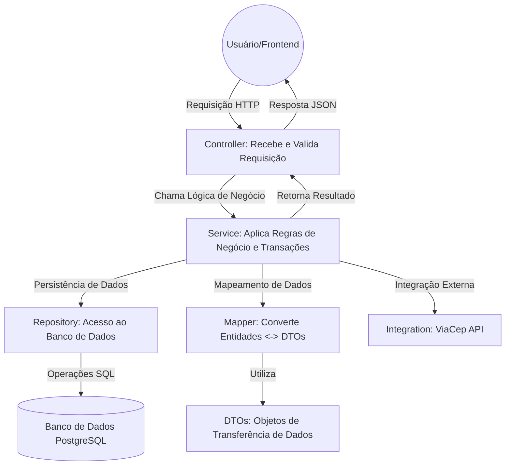
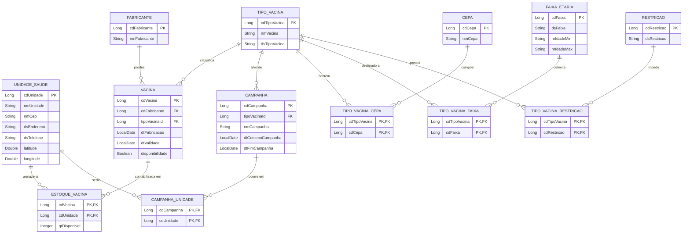

# LocVac API - Sistema de Gerenciamento de Vacinação

[](https://www.oracle.com/java/)
[](https://spring.io/projects/spring-boot)
[](https://www.postgresql.org/)

## 1. Visão Geral do Projeto

### Descrição Objetiva
A **LocVac API** é uma solução de backend desenvolvida em Java com Spring Boot, projetada para otimizar o gerenciamento e a localização de vacinas em unidades de saúde. O sistema oferece funcionalidades para o controle rigoroso de estoques de vacinas, o agendamento e a gestão de campanhas de vacinação, e a consulta geolocalizada de postos de saúde, visando facilitar o acesso da população às doses disponíveis e apoiar a gestão de saúde pública.

### Problema que Resolve
O projeto visa mitigar a fragmentação de informações sobre a disponibilidade de vacinas, um desafio comum em sistemas de saúde. Ele resolve a dificuldade dos cidadãos em identificar unidades de saúde com vacinas específicas em estoque e capacita os gestores de saúde com ferramentas para o monitoramento em tempo real da distribuição de lotes, datas de validade e cobertura vacinal, incluindo dados por faixa etária e restrições.

### Tecnologias Utilizadas
*   **Backend:** Java 17, Spring Boot 4.0.1, Spring Data JPA, Hibernate.
*   **Banco de Dados:** PostgreSQL (para ambientes de produção) e H2 Database (para testes e desenvolvimento local).
*   **Mapeamento de Objetos:** MapStruct, para a conversão eficiente e segura entre DTOs (Data Transfer Objects) e entidades de domínio.
*   **Integrações Externas:** Utilização da API ViaCep para a validação e preenchimento automático de informações de endereço, a partir de um CEP.
*   **Validação de Dados:** Implementação de Bean Validation (Hibernate Validator), incluindo validações customizadas para formatos de telefone e a garantia de campos obrigatórios.

### Arquitetura Adotada
O sistema emprega uma **Arquitetura em Camadas (Layered Architecture)**, seguindo o padrão **MVC (Model-View-Controller)**. Esta abordagem promove a separação clara de responsabilidades, resultando em um código mais organizado, modular, de fácil manutenção e alta testabilidade.

---

## 2. Arquitetura do Sistema

### Organização de Pacotes
A estrutura de diretórios do projeto segue as convenções idiomáticas do ecossistema Spring, organizando o código em pacotes lógicos que refletem suas responsabilidades:

```text
com.api.locvac
├── config          # Classes de configuração para o Spring (ex: CORS, RestTemplate).
├── controller      # Camada de apresentação, responsável por expor os endpoints REST e lidar com requisições HTTP.
├── dto             # Data Transfer Objects (DTOs) para entrada (Request), saída (Response) e atualização parcial (Patch) de dados.
├── integration     # Clientes e modelos para integração com serviços externos (ex: ViaCep).
├── mapper          # Interfaces MapStruct para mapeamento entre DTOs e entidades de domínio.
├── model           # Entidades JPA que representam o esquema do banco de dados, incluindo classes para associações e IDs compostos.
├── repository      # Interfaces de acesso a dados, utilizando Spring Data JPA para operações de CRUD e consultas customizadas.
├── service         # Camada de lógica de negócios, onde as regras de negócio complexas são aplicadas e as transações são gerenciadas.
├── utils           # Classes utilitárias de propósito geral (ex: validação de período, manipulação de associações).
└── validation      # Anotações e implementações de validadores customizados para o Bean Validation.
```

### Responsabilidade das Camadas
*   **Controller:** Atua como a porta de entrada para o sistema, recebendo requisições HTTP, realizando validações básicas dos DTOs de entrada e orquestrando a resposta. É responsável por retornar os códigos de status HTTP apropriados.
*   **Service:** Constitui o núcleo da lógica de negócios. Esta camada é responsável por aplicar regras de negócio complexas, gerenciar transações, coordenar a comunicação entre os repositórios e, quando necessário, interagir com serviços de integração externos.
*   **Repository:** Fornece uma abstração para a camada de persistência de dados. Utiliza o Spring Data JPA para simplificar as operações de CRUD (Create, Read, Update, Delete) e permite a definição de consultas customizadas para interagir com o banco de dados.
*   **Model:** Define as entidades de domínio do sistema, que são mapeadas para tabelas no banco de dados. Estas classes representam a estrutura dos dados e as relações entre eles.
*   **DTO (Data Transfer Object):** Objetos utilizados para transferir dados entre as camadas do sistema e para a comunicação com clientes externos. Eles garantem que apenas os dados necessários sejam expostos, protegendo a integridade e a estrutura das entidades de domínio internas.

### Diagrama de Arquitetura (Fluxo de Requisição)
O diagrama a seguir ilustra o fluxo típico de uma requisição HTTP através das camadas da aplicação:



---

## 3. Modelo de Dados

### 3.1 Diagrama Entidade-Relacionamento (DER)

O modelo de dados da LocVac API é cuidadosamente projetado para gerenciar as complexas relações entre os tipos de vacinas, os lotes físicos de vacinas, as unidades de saúde onde são armazenadas e aplicadas, e as campanhas de vacinação. Ele suporta a rastreabilidade e a gestão eficiente de todo o ciclo de vida da vacinação.



---

## 4. Principais Funcionalidades e Regras de Negócio

1.  **Geolocalização Automática de Unidades de Saúde:** Ao cadastrar uma nova unidade de saúde, o sistema utiliza a integração com a API ViaCep para buscar e preencher automaticamente o endereço completo, além de calcular e armazenar as coordenadas de latitude e longitude, facilitando a busca por proximidade.
2.  **Gestão Detalhada de Lotes de Vacinas:** Permite o controle individualizado de cada lote de vacina, registrando informações como fabricante, tipo de vacina, data de fabricação e, crucialmente, a data de validade. Isso garante a segurança e a eficácia das vacinas administradas.
3.  **Controle de Estoque por Unidade:** Gerencia a quantidade de doses disponíveis de cada vacina em cada unidade de saúde. As atualizações de estoque são atômicas, garantindo a consistência dos dados e refletindo a disponibilidade em tempo real para os cidadãos.
4.  **Campanhas de Vacinação Temporais:** Possibilita a criação e gestão de campanhas de vacinação com datas de início e fim bem definidas. As campanhas podem ser associadas a tipos específicos de vacinas e a múltiplas unidades de saúde, com validações para garantir que as datas sejam lógicas (início antes do fim).
5.  **Especificações Técnicas de Vacinas:** Permite o cadastro detalhado de tipos de vacinas, incluindo suas cepas, faixas etárias recomendadas e restrições de uso. Isso assegura que a vacina correta seja administrada ao público-alvo adequado, respeitando as contraindicações.

---

## 5. Como Executar o Projeto

Para configurar e executar a LocVac API em seu ambiente local, siga os passos abaixo:

1.  **Clone o Repositório:**
    Utilize o Git para clonar o projeto para sua máquina local:
    ```bash
    git clone https://github.com/claraneves23/locvac-api.git
    cd locvac-api/locvac
    ```

2.  **Configuração do Banco de Dados:**
    O projeto utiliza PostgreSQL como banco de dados principal. Certifique-se de ter uma instância do PostgreSQL em execução. Edite o arquivo `src/main/resources/application.properties` para configurar as credenciais do seu banco de dados:
    ```properties
    spring.datasource.url=jdbc:postgresql://localhost:5432/locvac_db
    spring.datasource.username=seu_usuario
    spring.datasource.password=sua_senha
    spring.jpa.hibernate.ddl-auto=update
    spring.jpa.show-sql=true
    ```
    *Nota: Para testes, o H2 Database em memória é configurado automaticamente.* 

3.  **Executar o Projeto:**
    Navegue até o diretório raiz do projeto (`locvac-api/locvac`) e execute a aplicação Spring Boot usando Maven:
    ```bash
    mvn spring-boot:run
    ```

4.  **Acesso à API:**
    Após a inicialização bem-sucedida, a API estará disponível em `http://localhost:8080`. Você pode usar ferramentas como Postman ou Insomnia para testar os endpoints.

---

